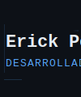

<!--
  Instrucciones: Guarda el bloque SVG como banner.svg en la raíz de tu repositorio
  y asegúrate de que el archivo README.md esté también en la raíz.
-->

  

 

## Sobre mí

Soy estudiante de desarrollo de software enfocado en **backend** y aplicaciones en **Java**. Me apasiona construir proyectos prácticos para profundizar en programación orientada a objetos y entender cómo funcionan los sistemas reales.

Actualmente trabajo con Java, Git y GitHub, siguiendo buenas prácticas como organización del código y control de versiones.

Mi objetivo: crear aplicaciones funcionales, bien estructuradas y escalables.

 

## Proyectos

| Proyecto | Descripción | Tecnología |
|---|---|---|
| [JavaCar](https://github.com/berserker012299-boop/JavaCar) | Sistema de gestión de alquiler de vehículos | Java |
| [CV Web](https://github.com/berserker012299-boop/Resume) | Currículum personal | HTML · CSS |
| [Skyscraper Puzzle](https://github.com/berserker012299-boop/SkyCrapper-Puzlle) | Puzzle lógico | Java |

 

## Stack

